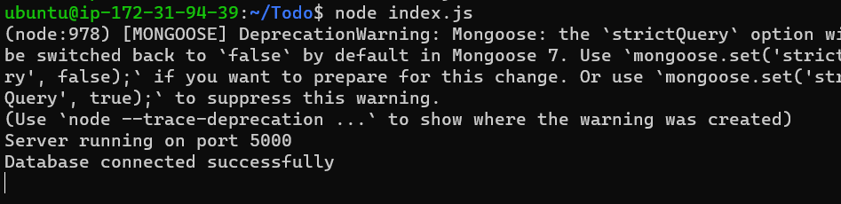
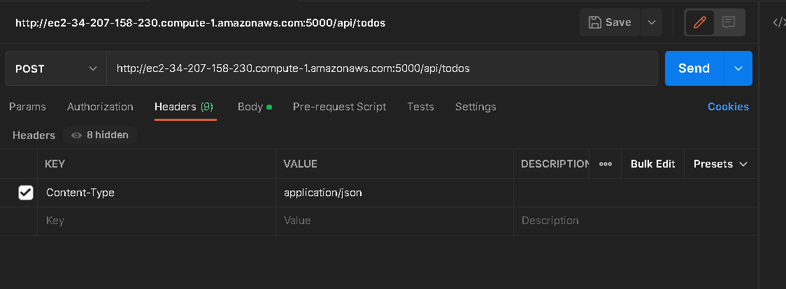

# MERN STACK IMPLEMENTATION

## STEP 0   
- Create an EC2 instance


## STEP ! - BACKEND CONFIGURATION
- update ubuntu
```
sudo apt update
```


- upgrade ubuntu
```
sudo apt upgrade
```


- Get the location of Node.js software from Ubuntu repositories.
```
curl -fsSL https://deb.nodesource.com/setup_18.x | sudo -E bash -
```


- Install nodejs
```
sudo apt-get install -y nodejs
```


- Create a new directory for To-Do project
```
mkdir Todo
```


- Run ```ls``` to verify that Todo directory is created


- change current directory to the newly created one
```
cd Todo
```


- initialise Todo project with `npm init`. A file named package.json will be created. Follow prompt to finish


- run `ls` to confirm file creation


- INSTALL EXPRESSJS
```
npm install express
```


- create index file
```
touch index.js
```


- install dotenv module
```
npm install dotenv
```


- open index.js using `vim index.js` and paste the below code
```
const express = require('express');
require('dotenv').config();

const app = express();

const port = process.env.PORT || 5000;

app.use((req, res, next) => {
res.header("Access-Control-Allow-Origin", "\*");
res.header("Access-Control-Allow-Headers", "Origin, X-Requested-With, Content-Type, Accept");
next();
});

app.use((req, res, next) => {
res.send('Welcome to Express');
});

app.listen(port, () => {
console.log(`Server running on port ${port}`)
});
```

- Check if server is running using `node index.js`


- Open TCP port 5000 on inbound rules for the ec2 instance


- open `http://<PublicIP-or-PublicDNS>:5000` to check


- ROUTES
There are three actions that our To-Do application needs to be able to do:

Create a new task
Display list of all tasks
Delete a completed task
Each task will be associated with some particular endpoint and will use different standard HTTP request methods: POST, GET, DELETE.

For each task, we need to create routes that will define various endpoints that the To-do app will depend on.

- use `mkdir routes` to create routes folder and `cd routes` to change current directory to the created folder


- create api.js using `touch api.js` and paste the code below into the file using `vim api.js`

```
const express = require ('express');
const router = express.Router();

router.get('/todos', (req, res, next) => {

});

router.post('/todos', (req, res, next) => {

});

router.delete('/todos/:id', (req, res, next) => {

})

module.exports = router;
```


## MODELS

Now comes the interesting part, since the app is going to make use of Mongodb which is a NoSQL database, we need to create a model.

A model is at the heart of JavaScript based applications, and it is what makes it interactive.

We will also use models to define the database schema . This is important so that we will be able to define the fields stored in each Mongodb document. (Seems like a lot of information, but not to worry, everything will become clear to you over time. I promise!!!)

In essence, the Schema is a blueprint of how the database will be constructed, including other data fields that may not be required to be stored in the database. These are known as virtual properties

To create a Schema and a model, install mongoose which is a Node.js package that makes working with mongodb easier.

- Change directory to Todo and install Mongoose
```
npm install mongoose
```


- make a folder models `mkdir models`, change to th directory `cd models` and create a todo.js file `touch todo.js` or use `mkdir models && cd models && touch todo.js` to do all three


- open the file created with `vim todo.js` and paste the code below 
```
const mongoose = require('mongoose');
const Schema = mongoose.Schema;

//create schema for todo
const TodoSchema = new Schema({
action: {
type: String,
required: [true, 'The todo text field is required']
}
})

//create model for todo
const Todo = mongoose.model('todo', TodoSchema);

module.exports = Todo;
```


- in routes directory, open api.js, delete existing code with `:%d` and paste the code below
```
const express = require ('express');
const router = express.Router();
const Todo = require('../models/todo');

router.get('/todos', (req, res, next) => {

//this will return all the data, exposing only the id and action field to the client
Todo.find({}, 'action')
.then(data => res.json(data))
.catch(next)
});

router.post('/todos', (req, res, next) => {
if(req.body.action){
Todo.create(req.body)
.then(data => res.json(data))
.catch(next)
}else {
res.json({
error: "The input field is empty"
})
}
});

router.delete('/todos/:id', (req, res, next) => {
Todo.findOneAndDelete({"_id": req.params.id})
.then(data => res.json(data))
.catch(next)
})

module.exports = router;
```


### MONGODB DATABASE

- Create a database in Mongodb


- Allow access to the mongodb from anywhere


- create a file in the Todo directory named .env
```
touch .env
```


- add the following string in the file, replacing username, password, network-address and database according to the setup
```
DB = 'mongodb+srv://<username>:<password>@<network-address>/<dbname>?retryWrites=true&w=majority'
```


- update index.js to reflect the use of .env so that Node.js can connect to the database. `vim index.js` and use `:%d` to clear the file. Paste the below code
```
const express = require('express');
const bodyParser = require('body-parser');
const mongoose = require('mongoose');
const routes = require('./routes/api');
const path = require('path');
require('dotenv').config();

const app = express();

const port = process.env.PORT || 5000;

//connect to the database
mongoose.connect(process.env.DB, { useNewUrlParser: true, useUnifiedTopology: true })
.then(() => console.log(`Database connected successfully`))
.catch(err => console.log(err));

//since mongoose promise is depreciated, we overide it with node's promise
mongoose.Promise = global.Promise;

app.use((req, res, next) => {
res.header("Access-Control-Allow-Origin", "\*");
res.header("Access-Control-Allow-Headers", "Origin, X-Requested-With, Content-Type, Accept");
next();
});

app.use(bodyParser.json());

app.use('/api', routes);

app.use((err, req, res, next) => {
console.log(err);
next();
});

app.listen(port, () => {
console.log(`Server running on port ${port}`)
});
```


- start server using `node index.js`



### Testing Backend Code without Frontend using RESTful API
So far we have written backend part of our To-Do application, and configured a database, but we do not have a frontend UI yet. We need ReactJS code to achieve that. But during development, we will need a way to test our code using RESTfulL API. Therefore, we will need to make use of some API development client to test our code.

In this project, we will use Postman to test our API.

- install Postman from the website
- Now open your Postman, create a POST request to the API `http://<PublicIP-or-PublicDNS>:5000/api/todos`. This request sends a new task to our To-Do list so the application could store it in the database. Ensure to set header key of Content-Type as application/json.




- Create a GET request to your API on `http://<PublicIP-or-PublicDNS>:5000/api/todos`. This request retrieves all existing records from out To-do application (backend requests these records from the database and sends it us back as a response to GET request).


## STEP 2-FRONTEND CREATION

Creating a user interface for a web client to interact with the application via API. To start out with the frontend of the To-do app, we use the create-react-app command to scaffold the app.

- In the Todo directory, run 
```
npx create-react-app client
```


### Install dependencies
- Install concurrently to allow running more than one command simultaneously from the same terminal window
`npm install concurrently --save-dev`


- Install nodemon used to run and monitor the server.  If there is any change in the server code, nodemon will restart it automatically and load the new changes.
`npm install nodemon --save-dev`


- open package.json file and update the "scripts"... with the below code
```
"scripts": {
"start": "node index.js",
"start-watch": "nodemon index.js",
"dev": "concurrently \"npm run start-watch\" \"cd client && npm start\""
},
```


- change directory to client `cd client`
- open the package.json and add key value pair `"proxy": "http://localhost:5000"`
The whole purpose of adding the proxy configuration in number 3 above is to make it possible to access the application directly from the browser by simply calling the server url like http://localhost:5000 rather than always including the entire path like http://localhost:5000/api/todos


- in the Todo directory, run `npm run dev`. App should start running on localhost:3000. It is important to open TCP port 3000 on EC2


### Creating React Components
One of the advantages of react is that it makes use of components, which are reusable and also makes code modular. For our Todo app, there will be two stateful components and one stateless component.

- from the Todo directory, change directory to client `cd client`, move to src directory `cd src`, create components folder `mkdir components`, move to components folder `cd components` and create 3 files `touch Input.js ListTodo.js Todo.js`


- copy and paste below code to Input.js file
```
import React, { Component } from 'react';
import axios from 'axios';

class Input extends Component {

state = {
action: ""
}

addTodo = () => {
const task = {action: this.state.action}

    if(task.action && task.action.length > 0){
      axios.post('/api/todos', task)
        .then(res => {
          if(res.data){
            this.props.getTodos();
            this.setState({action: ""})
          }
        })
        .catch(err => console.log(err))
    }else {
      console.log('input field required')
    }

}

handleChange = (e) => {
this.setState({
action: e.target.value
})
}

render() {
let { action } = this.state;
return (
<div>
<input type="text" onChange={this.handleChange} value={action} />
<button onClick={this.addTodo}>add todo</button>
</div>
)
}
}

export default Input
```
To make use of Axios, which is a Promise based HTTP client for the browser and node.js, you need to cd into your client from your terminal and run yarn add axios or npm install axios.

- install axios `npm install axios`


- go to components directory `cd src/components`, open ListTodo.js and paste the code below
```
import React from 'react';

const ListTodo = ({ todos, deleteTodo }) => {

return (
<ul>
{
todos &&
todos.length > 0 ?
(
todos.map(todo => {
return (
<li key={todo._id} onClick={() => deleteTodo(todo._id)}>{todo.action}</li>
)
})
)
:
(
<li>No todo(s) left</li>
)
}
</ul>
)
}

export default ListTodo
```


- paste the below code in Todo.js file
```
import React, {Component} from 'react';
import axios from 'axios';

import Input from './Input';
import ListTodo from './ListTodo';

class Todo extends Component {

state = {
todos: []
}

componentDidMount(){
this.getTodos();
}

getTodos = () => {
axios.get('/api/todos')
.then(res => {
if(res.data){
this.setState({
todos: res.data
})
}
})
.catch(err => console.log(err))
}

deleteTodo = (id) => {

    axios.delete(`/api/todos/${id}`)
      .then(res => {
        if(res.data){
          this.getTodos()
        }
      })
      .catch(err => console.log(err))

}

render() {
let { todos } = this.state;

    return(
      <div>
        <h1>My Todo(s)</h1>
        <Input getTodos={this.getTodos}/>
        <ListTodo todos={todos} deleteTodo={this.deleteTodo}/>
      </div>
    )

}
}

export default Todo;
```


- make little adjustment to the react code. Delete logo and adjust App.js. Move to the src folder and paste below code into App.js file
```
 import React from 'react';

import Todo from './components/Todo';
import './App.css';

const App = () => {
return (
<div className="App">
<Todo />
</div>
);
}

export default App;
```


- paste the below code into App.css
```
.App {
text-align: center;
font-size: calc(10px + 2vmin);
width: 60%;
margin-left: auto;
margin-right: auto;
}

input {
height: 40px;
width: 50%;
border: none;
border-bottom: 2px #101113 solid;
background: none;
font-size: 1.5rem;
color: #787a80;
}

input:focus {
outline: none;
}

button {
width: 25%;
height: 45px;
border: none;
margin-left: 10px;
font-size: 25px;
background: #101113;
border-radius: 5px;
color: #787a80;
cursor: pointer;
}

button:focus {
outline: none;
}

ul {
list-style: none;
text-align: left;
padding: 15px;
background: #171a1f;
border-radius: 5px;
}

li {
padding: 15px;
font-size: 1.5rem;
margin-bottom: 15px;
background: #282c34;
border-radius: 5px;
overflow-wrap: break-word;
cursor: pointer;
}

@media only screen and (min-width: 300px) {
.App {
width: 80%;
}

input {
width: 100%
}

button {
width: 100%;
margin-top: 15px;
margin-left: 0;
}
}

@media only screen and (min-width: 640px) {
.App {
width: 60%;
}

input {
width: 50%;
}

button {
width: 30%;
margin-left: 10px;
margin-top: 0;
}
}
```
- paste the below code into index.css file
```
body {
margin: 0;
padding: 0;
font-family: -apple-system, BlinkMacSystemFont, "Segoe UI", "Roboto", "Oxygen",
"Ubuntu", "Cantarell", "Fira Sans", "Droid Sans", "Helvetica Neue",
sans-serif;
-webkit-font-smoothing: antialiased;
-moz-osx-font-smoothing: grayscale;
box-sizing: border-box;
background-color: #282c34;
color: #787a80;
}

code {
font-family: source-code-pro, Menlo, Monaco, Consolas, "Courier New",
monospace;
}
```
- go to Todo directory and run `npm run dev`


- Todo app successfully created. `http://http://34.207.158.230:3000/`


## DONE!
