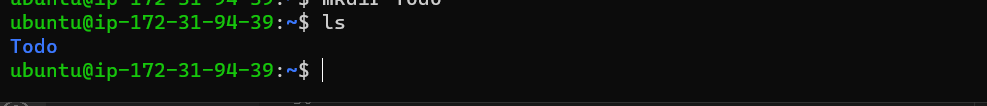
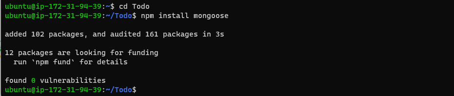

# MERN STACK IMPLEMENTATION

## STEP 0   
- Create an EC2 instance


## STEP ! - BACKEND CONFIGURATION
- update ubuntu
```
sudo apt update
```


- upgrade ubuntu
```
sudo apt upgrade
```


- Get the location of Node.js software from Ubuntu repositories.
```
curl -fsSL https://deb.nodesource.com/setup_18.x | sudo -E bash -
```


- Install nodejs
```
sudo apt-get install -y nodejs
```


- Create a new directory for To-Do project
```
mkdir Todo
```


- Run ```ls``` to verify that Todo directory is created


-change current directory to the newly created one
```
cd Todo
```


- initialise Todo project with `npm init`. A file named package.json will be created. Follow prompt to finish


- run `ls` to confirm file creation


- INSTALL EXPRESSJS
```
npm install express
```


- create index file
```
touch index.js
```


- install dotenv module
```
npm install dotenv
```


- open index.js using `vim index.js` and paste the below code
```
const express = require('express');
require('dotenv').config();

const app = express();

const port = process.env.PORT || 5000;

app.use((req, res, next) => {
res.header("Access-Control-Allow-Origin", "\*");
res.header("Access-Control-Allow-Headers", "Origin, X-Requested-With, Content-Type, Accept");
next();
});

app.use((req, res, next) => {
res.send('Welcome to Express');
});

app.listen(port, () => {
console.log(`Server running on port ${port}`)
});
```

- Check if server is running using `node index.js`


- Open TCP port 5000 on inbound rules for the ec2 instance


- open `http://<PublicIP-or-PublicDNS>:5000` to check


- ROUTES
There are three actions that our To-Do application needs to be able to do:

Create a new task
Display list of all tasks
Delete a completed task
Each task will be associated with some particular endpoint and will use different standard HTTP request methods: POST, GET, DELETE.

For each task, we need to create routes that will define various endpoints that the To-do app will depend on.

- use `mkdir routes` to create routes folder and `cd routes` to change current directory to the created folder


- create api.js using `touch api.js` and paste the code below into the file using `vim api.js`

```
const express = require ('express');
const router = express.Router();

router.get('/todos', (req, res, next) => {

});

router.post('/todos', (req, res, next) => {

});

router.delete('/todos/:id', (req, res, next) => {

})

module.exports = router;
```


## MODELS

Now comes the interesting part, since the app is going to make use of Mongodb which is a NoSQL database, we need to create a model.

A model is at the heart of JavaScript based applications, and it is what makes it interactive.

We will also use models to define the database schema . This is important so that we will be able to define the fields stored in each Mongodb document. (Seems like a lot of information, but not to worry, everything will become clear to you over time. I promise!!!)

In essence, the Schema is a blueprint of how the database will be constructed, including other data fields that may not be required to be stored in the database. These are known as virtual properties

To create a Schema and a model, install mongoose which is a Node.js package that makes working with mongodb easier.

- Change directory to Todo and install Mongoose
```
npm install mongoose
```


- make a folder models `mkdir models`, change to th directory `cd models` and create a todo.js file `touch todo.js` or use `mkdir models && cd models && touch todo.js` to do all three


- open the file created with `vim todo.js` and paste the code below 
```
const mongoose = require('mongoose');
const Schema = mongoose.Schema;

//create schema for todo
const TodoSchema = new Schema({
action: {
type: String,
required: [true, 'The todo text field is required']
}
})

//create model for todo
const Todo = mongoose.model('todo', TodoSchema);

module.exports = Todo;
```


- in routes directory, open api.js, delete existing code with `:%d` and paste the code below
```
const express = require ('express');
const router = express.Router();
const Todo = require('../models/todo');

router.get('/todos', (req, res, next) => {

//this will return all the data, exposing only the id and action field to the client
Todo.find({}, 'action')
.then(data => res.json(data))
.catch(next)
});

router.post('/todos', (req, res, next) => {
if(req.body.action){
Todo.create(req.body)
.then(data => res.json(data))
.catch(next)
}else {
res.json({
error: "The input field is empty"
})
}
});

router.delete('/todos/:id', (req, res, next) => {
Todo.findOneAndDelete({"_id": req.params.id})
.then(data => res.json(data))
.catch(next)
})

module.exports = router;
```


